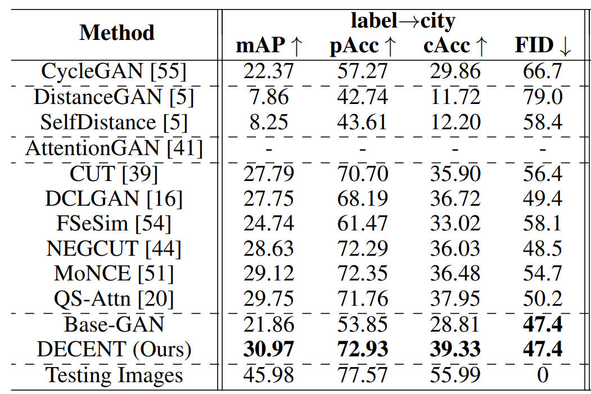

## Overview

label2city is a benchmark image-to-image translation task. Now most methods use DRN to evaluate the models.
But different pretrained models and evaluation protocls can lead to different results. 
Here we provide such implementation and we hope this could help address the performance inconsistency problem.

## How do we evaluate 
This is our for evaluating the performance on label2city image-to-image task.
Given input segmentation labels, we feed images into any translation model (e.g.,CycleGAN, CUT, DECENT) and generate photos.
Then we use Pretrained-Segmentation model (DRN) to predict label from the generated photo.
Finally, we compare the predicted labels with the input labels.


## Usage
```bash
sh eval.sh ./relative_path/to/your/generated/cityscapes/photos
```
If your generated photos are not png format or you have an absolute path, please 
change the first line of      ```demo_cityscapes/creat_lish.sh```

## Existing Results

We re-evaluate all methods with this code:




## Citation
If you use this code for your research, please cite our [paper](https://openreview.net/pdf?id=RNZ8JOmNaV4):

```
@inproceedings{xieunsupervised,
  title={Unsupervised Image-to-Image Translation with Density Changing Regularization},
  author={Xie, Shaoan and Ho, Qirong and Zhang, Kun},
  booktitle={Advances in Neural Information Processing Systems},
year=2022,
}


